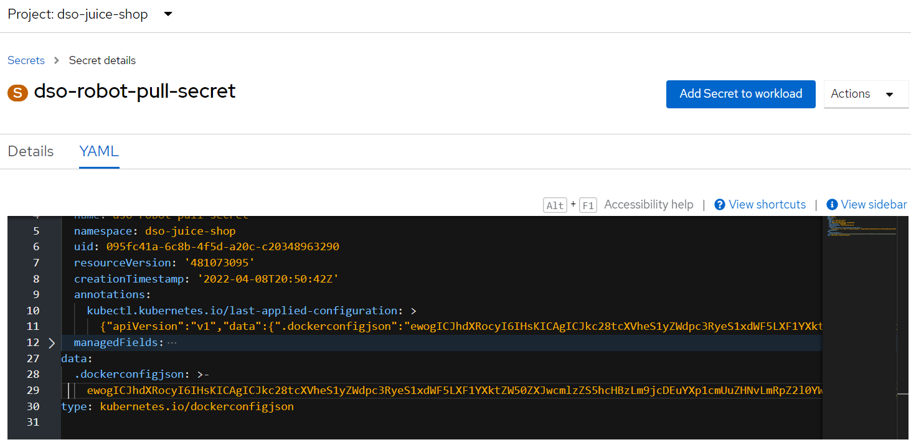

# Introduction #
  Argo CD automates the deployment of the desired application states in the specified target environments. 
  Application deployments can track updates to branches, tags, or pinned to a specific version of manifests on commit.

# Pre requisite #
  ArgoCD instance is running on a namespace ( eg : <namespace>-argo ) as part of onboarding process if not reach out DSO team.
  
  Robot account for pull image in place and added to pipeline service account.

  
To create  Robot account  click on the robot accounts tab and click on the &quot;Create Robot account&quot;


As can be seen above a robot\_team\_a account is created. (Use account name relevant to your project)

Clicking on the account name displays the credentials for the robot account to configure a secret to be used on the pipelines. There is also option to regenerate new token for the robot account.


## Pull secret:

Create Kubernatives pull secret with secret .dockerconfigjson


Create secret on ocp and add it to the pipleline and default services accounts.
Example screenshot


## Add Pull secret to Service accounts


Add secret to pipeline and service account under ImagePullSecret

Example screenshot


# Summary #
  List of steps which are required to follow in order configure the application deployment.
  
# Onboarding #

1. User logs in to OCP (through Google id)  in a specific ArgoCD ( eg :<namespace>-argo ) which was shared by DSO team as part of onboarding process.
  

 ```
  Select Project => Networking => Routes then click the url under Location tab.
  ```


2.	Url should be open the ArgoCD browser.


Configure repository 

    => Click on settings -> Configure ArgoCD
  
```
 repo-config.yaml
```
 ```
                  apiVersion: v1
                  kind: Secret
                  metadata:
                    name: product-pagesargocd-secret
                    namespace: product-pages-argo
                    labels:
                      argocd.argoproj.io/secret-type: repository
                  stringData:
                    url: https://github.com/defencedigital/<repo-name>
                    password: <PAT>
                    username: not-used
  ```

Run the command via ArgoCD namespace
  
```
  oc apply -f < repo-config.yaml> -n  <argocd namespace>
```


3.	Application configuration.

  
  ```
  simple-app.yaml
 ```
  
  ```
          apiVersion: argoproj.io/v1alpha1
          kind: Application
          metadata:
            name: product-pages-sa-example
            namespace: product-pages-argo
          spec:
            destination:
              namespace: product-pages
              server: https://kubernetes.default.svc
            project: default
            source:
              directory:
                recurse: true
              path: argocd-managedNamespace/product-pages/sa_example
              repoURL: https://github.com/defencedigital/<repo-name>.git
              targetRevision: HEAD
            syncPolicy:
              automated:
                prune: true
                selfHeal: true
```

  Run the command via ArgoCD namespace
  
```
  oc apply -f < simple-app.yaml> -n  <argocd namespace>
```
# ArgoCD page #


 # Sync/Deploy #
  
  => Once deployment of CRD is completed on ArgoCD. an auto synch/deploy process begins.
  
  => Subsequent deployment can be imitated through the synch button or through changes on GitHub repo
  
