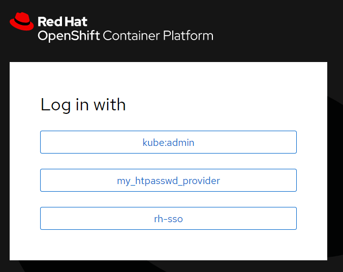
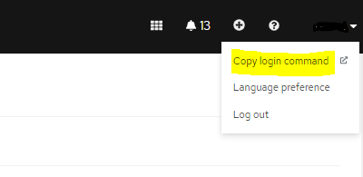
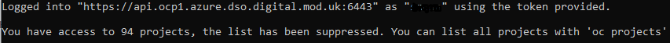
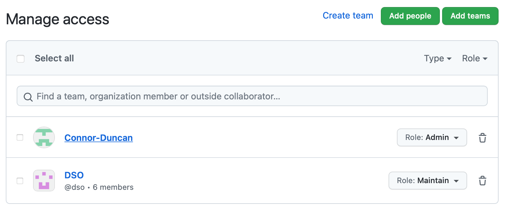
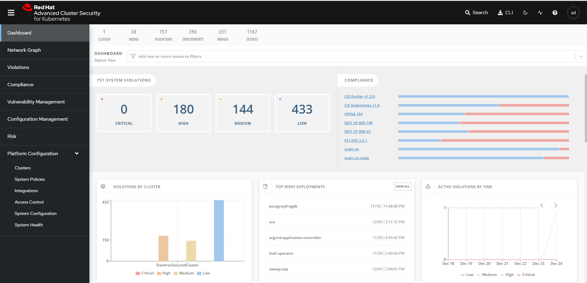
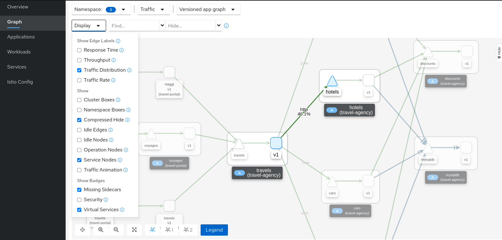
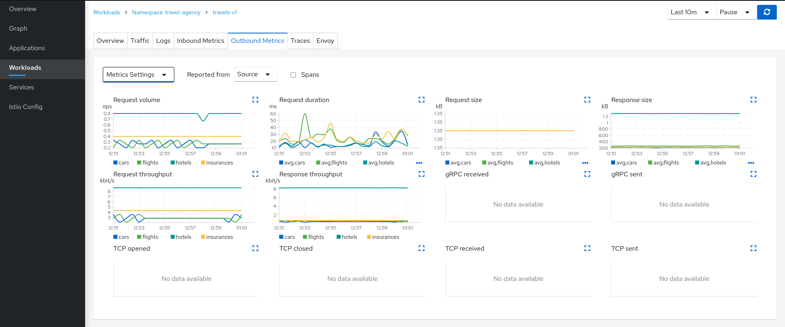

# User Guide

## Contents 
1. [Prerequisites](#Prerequisites)
2. [List of Services](#List-of-Services)
3. [Access to Platform](#Access-to-Platform)
4. [Access to Namespace](#Access-to-Namespace)
5. [Monitoring](#Monitoring)
6. [Logging](#Logging)
7. [SCM](#SCM)
8. [Continuous Integration](#Continuous-Integration)  
9. [Continuous Delivery](#Continuous-Delivery)  
10. [Build](#Build)
11. [Testing](#Testing)
12. [Container Store](#Container-Store)
13. [Secret Store](#Secret-Store)
14. [Visualisation](#Visualisation)
15. [Distributed Tracing](#Distributed-Tracing)  
16. [Naming Convention](#Naming-Convention)  
17. [Pipeline Creation](#pipeline-creation)
----------------------------------------------------------------------------------------------------------------------------------

## OCP Version

4.8

## Prerequisites  	 

<a href="#home">Home</a>

1.	Read and sign policy documents located <a href="https://github.com/defencedigital/dso-scm/blob/main/Policy-Docs/Usage-Policies.md"> here.</a>
2.	A Defense Digital Service (DDS) account required as a '@digital.mod.uk' Google email account. 
3.	Access to defence digital Github instance
4.	Project is onboarded and namespace created (created by team lead)
5.	If team lead, they will need admin permission on relevant Github repo. see details [here.](#github-permission)  
6.	OpenShift CLI version (Client Version: 4.8.0) is <a href="https://console-openshift-console.apps.ocp1.azure.dso.digital.mod.uk/command-line-tools">downloaded</a> and can be started from command line  

## List of Services 

<table>
  <tr>
    <th>Environment</th> 	<th>Dev/Test</th>    <th>Runtime</th>    <th>Preprod</th>
  </tr>
  <tr>
    <td>Web Console </td>	<td> <a href="https://console-openshift-console.apps.ocp1.azure.dso.digital.mod.uk/">Openshift Platform</a> </td>	<td></td>    <td></td>
  </tr>
  <tr>
    <td>Monitoring</td>		<td><a href="https://grafana-openshift-monitoring.apps.ocp1.azure.dso.digital.mod.uk/">Grafana</a></td>		<td></td>    <td></td>
  </tr>
  <tr>
    <td>Logging</td>		<td><a href="https://kibana-openshift-logging.apps.ocp1.azure.dso.digital.mod.uk">Kibana</a></td>	<td></td>    <td></td>
  </tr>	
  <tr>
    <td>SCM</td>		<td><a href="https://github.com/defencedigital">Github</a></td>	 <td></td>    <td></td>
  </tr>	
  <tr>
    <td>Continuous Integration</td> 	<td><a href="https://console-openshift-console.apps.ocp1.azure.dso.digital.mod.uk/pipelines">Pipeline tool (Tekton)</a></td>	 <td></td>   <td></td>
  </tr>
  <tr>
    <td>Continuous Delivery</td>		<td><a>GitOps (ArgoCD) </a></td>	 <td></td>    <td></td>
  </tr>
  <tr>
    <td>Build</td>		<td>Maven</td>	 <td></td>    <td></td>
  </tr>
  <tr>
    <td>Build</td>		<td>Buildah</td>	 <td></td>    <td></td>
  </tr>
  <tr>
    <td>Testing (SAST)</td>		<td><a href="https://sonarqube-https-dso-tooling-sonar.apps.ocp1.azure.dso.digital.mod.uk">SonarQube </a></td>	 <td></td>    <td></td>
  </tr>
  <tr>
    <td>Testing (DAST)</td>		<td>OWASPZAP</td>	 <td></td>    <td></td>
  </tr>	
  <tr>
    <td>Testing (BDD)</td>		<td>Cucumber</td>	 <td></td>    <td></td>
  </tr>	
	
  <tr>
    <td> Testing (IAST-RAST)</td>		<td><a href="https://central-stackrox.apps.ocp1.azure.dso.digital.mod.uk">RedHat Advanced Cluster Security (RHACS)</a></td>	 <td></td>    <td></td>
  </tr>
  <tr>
    <td> Container Store</td>		<td><a href="https://dso-quay-registry-quay-quay-enterprise.apps.ocp1.azure.dso.digital.mod.uk">Quay</a></td>	 <td></td>    <td></td>
  </tr>
  <tr>
    <td> Secret Store</td>		<td><a href="https://vault-dso-tooling-vault.apps.ocp1.azure.dso.digital.mod.uk">Hashicorp Vault </a></td>	 <td></td>    <td></td>
	  
  </tr>	
  <tr>
    <td> Visualisation</td>		<td><a href="https://kiali-istio-system.apps.ocp1.azure.dso.digital.mod.uk/">Kiali</a></td>	 <td></td>    <td></td>
  </tr>
  <tr>
    <td> Distributed tracing</td>		<td><a href="https://jaeger-istio-system.apps.ocp1.azure.dso.digital.mod.uk/search">Jaeger</a></td>	 <td></td>    <td></td>
  </tr>
</table>

## Access to Platform 

_**OpenShift Web Console**_

URL: [OCP-Web-Console](https://console-openshift-console.apps.ocp1.azure.dso.digital.mod.uk/)
	
Ensure user has successfully logged into their DDS Google email account, within the same browser. Browse to the above link from the browser. 

Click on the 'rh-sso' option to logon to the OCP web console

On a second screen, the user will be promoted to chose logon method. Chose the 'Google' option.

If promoted, where not logged into users DDS Google account, enter DDS account credentials:

_**OpenShift Command Line Interface (CLI)**_
	
Access to CLI using the tokens displayed once connected to the web console above
	

 
Copy login command shown above -> Click on Display Token -> Copy the command on section “log in with this token”  -> paste on CLI console

Eg. oc login --token=<tocken data> --server=https://api.ocp1.azure.dso.digital.mod.uk:6443

On successful login the below screen appears
	

 
## Access to Namespace 
	
A user may not have access to relevant resources such as project namespace on first login. Request your project manager to onboard you to the relevant project (namespace) 
	
## Tool list |  Usage

Below tools are available to be used by projects. Access to some tools ( GitHub repos, ArgoCD, Vault Namespace and SonarQube projects/groups)  may need to be specifically requested.

### SCM  
	
<a href="https://github.com/defencedigital">Github</a>
- Authenticate using username/password on Website/Github Desktop or through IDE
- Branch as appropriate before commencing new work or feature
- Navigate to project to review/update/commit changes
- Merge changes back to master once reviewed/approved

**Permissions on Github** 

For someone to run the pipeline, they must use the Team Leads Personal Access Token (PAT) from Github.

If the Github repository has Pull Requests (PR) turned on, then the PAT must have admin privileges. For example, using the screenshot below, only COnnor-Duncan PAT will be able to run the pipeline, as PR’s are turned on and he is the only one with admin privileges. Members of the DSO group will not be able to use their PAT’s.

	
However, if PR requests are turned off (which is not advised), then anyone with write access will be able to run the pipeline with their own PAT.
	
### Continuous Integration  

<a href="https://console-openshift-console.apps.ocp1.azure.dso.digital.mod.uk/pipelines">Pipeline tool (Tekton)</a>

Tekton is an open source project that provides a framework to create cloud-native CI/CD pipelines quickly.

To use a pipeline the following tasks need to be completed at minimum.
- Create a Task
- Create a Pipeline containing your Tasks
- Use a TaskRun to instantiate and execute a Task outside of a Pipeline
- Use a PipelineRun to instantiate and run a Pipeline containing your Tasks

A Task defines a series of steps that run in a desired order and complete a set amount of build work. Every Task runs as a Pod on your Kubernetes cluster with each step as its own container.

A Pipeline defines an ordered series of Tasks that you want to execute along with the corresponding inputs and outputs for each Task. You can specify whether the output of one Task is used as an input for the next Task using the from property. Pipelines offer the same variable substitution as Tasks.

The PipelineRun automatically defines a corresponding TaskRun for each Task you have defined in your Pipeline collects the results of executing each TaskRun.

Resources |  <a href="https://developers.redhat.com/blog/2021/01/13/getting-started-with-tekton-and-pipelines#">Getting started</a>
	
	
### Continuous delivery  

<a> GitOps (ArgoCD) </a>
	
ArgoCD is a GitOps tool that helps with your GitOps workflows. ArgoCD can be used as a standalone tool or as a part of your CI/CD workflow. 

Argo CD follows the GitOps pattern of using Git repositories as the source of truth for defining the desired application state. Kubernetes manifests can be specified in several ways:

- customize applications
- helm charts
- ksonnet applications
- jsonnet files
- Plain directory of YAML/json manifests
- Any custom config management tool configured as a config management plugin

Argo CD automates the deployment of the desired application states in the specified target environments. Application deployments can track updates to branches, tags, or pinned to a specific version of manifests at a Git commit.

Resources |  <a href="https://argo-cd.readthedocs.io/en/stable/">Getting started</a>

### Build 
	
Maven

Maven is a build lifecycle framework that is used for building and managing Java projects. Maven's primary goal is to allow a developer to comprehend the complete state of a development effort in the shortest period of time. In order to attain this goal, Maven deals with several areas of concern:

- Making the build process easy
- Providing a uniform build system
- Providing quality project information
- Encouraging better development practices

via providing ways to manage: 
- Builds
- Documentation
- Reporting
- Dependencies
- SCMs
- Releases
- Distribution
	
Resource | [Getting Started](https://maven.apache.org/guides/getting-started/index.html)
	
Buildah

Buildah is a tool for building OCI-compatible images through a lower-level core utils interface. Buildah doesn't depend on a daemon such as Docker or CRI-O, it doesn't require root privileges, and has a smaller footprint (less bandwith and storage space utilised).
	
Buildah provides a command-line tool that replicates all the commands found in a Dockerfile (although it does have the ability to utilise a Dockerfile directly as well). This allows you to issue Buildah commands from a scripting language such as Bash, to create an OCI-compatible container image.
	
Resource | [Getting Started](https://github.com/containers/buildah/tree/main/docs/tutorials)

### Testing		
<a href="https://sonarqube-edb-dso-tooling-sonar.apps.ocp1.azure.dso.digital.mod.uk">**SAST - SonarQube** </a>

SonarQube is a static code analysis tool (SAST) which is widely used in Continuous Integration (CI) for code quality check.
To integrate with pipeline the following tasks need to be completed.
	
SonarQube Dashboard:
- Create project and token if it does not exist.
- Create Quality Gate criteria if it does not exist.
- User needs to be in the right group (assumption google id is already created and verified login on SonarQube).

Pipeline:
- Create sonar-project. properties file in the project, top level in the project hierarchy.
- Secret on vault is created and updated policies.
	
Eg:
	
	sonar.projectKey=dso-project-s0nar-scan-quality-gate
	
	sonar.projectname=dso-project
	
	sonar.host.url=https://sonarqube-edb-dso-tooling-sonar.apps.ocp1.azure.dso.digital.mod.uk/
	

- Create task for sonar scanning (must be done after git clone) task.
- Check the SonarQube Dashboard for status.
	
Quality Gate criteria can be created on new code or over all code quality. 

Resources | <a href="https://github.com/defencedigital/dso-blueprint-pipeline/blob/main/Pipeline/sonar-properties.properties">SonarQube configuration </a>| <a href="https://github.com/defencedigital/dso-blueprint-pipeline/blob/main/Pipeline/Tasks/sonarqube-scanner.yaml">Sonar Scanner Task Example </a> | <a href="https://sonarqube-edb-dso-tooling-sonar.apps.ocp1.azure.dso.digital.mod.uk/projects">SonarQube Dashboard </a>  | <a href="https://docs.sonarqube.org/latest/user-guide/concepts/">Getting Started</a>
	
**DAST – OWASPZAP**
	
Owasp Zap is a tool used for Dynamic Application Security Testing (DAST). It actively scans and interacts with web applications to try and identify vulnerabilities, scanning for things such as the OWASP Top 10 and misconfigurations. 

Resources |  <a href="https://www.zaproxy.org/docs/docker/about/">Tool documentation </a>    |    <a href="https://github.com/defencedigital/dso-blueprint-pipeline/tree/master/Tools/OWASP-ZAP">Getting started</a>
	
**Cucumber**

Cucumber is a testing tool that supports Behavior Driven Development (BDD). It allows for executable tests to be written as easily understood specifications.

To use cucumber the following tasks need to be completed at a minimum.
- Creation of tests using CucumberJS + any additional dependencies 
- Create a Task that runs the previously created tests, and configure to access any services to be tested.
- Create a seperate 'post deployment' Pipeline containing your Tasks that should be run after the CD (ArgoCD) sync's the applications state
- Create a Tekton event listner that triggers a PipelineRun of the above pipeline
- Configure a BatchJob inside of your CD manifests folder to hit the event listener URL

Resources |  <a href="https://github.com/defencedigital/dso-blueprint-pipeline/tree/master/Tools/Cucumber">Tool installation</a>    | [Cucumber Task Example](https://github.com/defencedigital/dso-pipeline-integration/blob/master/book-info-cicd/tekton/task-run-node-test.yaml) | [Post Deployment Pipeline](https://github.com/defencedigital/dso-pipeline-integration/blob/master/book-info-cicd/tekton/pipeline-post-deployment.yaml) | [Event Listener](https://github.com/defencedigital/dso-pipeline-integration/tree/master/book-info-cicd/triggers/post-deployment) | [ArgoCD BatchJob](https://github.com/defencedigital/dso-project-bookinfo/blob/master/deploy-scripts-quay/job.yaml) | [Getting Started](https://cucumber.io/docs/guides/overview/)
	
<a href="https://central-stackrox.apps.ocp1.azure.dso.digital.mod.uk">**IAST-RAST- Red Hat Advanced Cluster Security for Kubernetes (RHACS)**</a>
	
RHACS simplifys DevSecOps by providing automated guardrails within existing workflows. RHACS integrates with CI/CD pipelines and image registries to provide continuous image scanning and assurance. By shifting security left, vulnerable and misconfigured images can be remediated within the same developer environment with real-time feedback and alerts.

Defend workloads... out-of-the-box deploy-time and runtime policies prevent risky workloads from being deployed or running.  RHACS monitors, collects, and evaluates system-level events such as process execution, network connections and flows, and privilege escalation within each container in environments. Combined with behavioral baselining and allowlisting, it detects anomalous activity indicative of malicious intent such as active malware, cryptomining, unauthorized credential access, intrusions, and lateral movement.

Protect the Kubernetes infrastructure... RHACS delivers advanced security capabilities to ensure the underlying Kubernetes infrastructure remains hardened and protected.  RHACS continuously scans your environment against CIS benchmarks and other security best practices and prevents misconfigurations and threats to deliver comprehensive Kubernetes-native protection.

Resources | <a href="https://catalog.redhat.com/software/operators/detail/60eefc88ee05ae7c5b8f041c#deploy-instructions"> Tool installation </a>| <a href="https://docs.openshift.com/acs/3.67/welcome/?extIdCarryOver=true&sc_cid=701f2000001OH7JAAW">Getting Started</a>

### Container store 

<a href="https://dso-quay-registry-quay-quay-enterprise.apps.ocp1.azure.dso.digital.mod.uk">**Quay**</a>

Red Hat Quay container registry platform provides secure storage, distribution, and governance of containers and cloud-native artifacts on any infrastructure. As a regular user of a Quay registry, you can create repositories to organize your images and selectively add read (pull) and write (push) access to the repositories you control. A user with administrative privileges can perform a broader set of tasks, such as the ability to add users and control default settings.

Users and organizations in Quay
Before you begin creating repositories to hold your container images in Project Quay, you should consider how you want to organize those repositories. Every repository in a Project Quay instance must be associated with either an Organization or a User.

Quay tenancy model

**Organizations** provide a way of sharing repositories under a common namespace that does not belong to a single user, but rather to many users in a shared setting (such as a company).

**Teams** provide a way for an organization to delegate permissions (both global and on specific repositories) to sets or groups of users

**Users** can log in to a registry through the Quay web UI or a client (such as podman login). Each users automatically gets a user namespace, for example, quay-server.example.com/user/<username>

**Super users** have enhanced access and privileges via the Super User Admin Panel in the user interface and through Super User API calls that are not visible or accessible to normal users

**Robot accounts** provide automated access to repositories for non-human users such as pipeline tools and are similar in nature to OpenShift service accounts. Permissions can be granted to a robot account in a repository by adding that account like any other user or team.
	
Resources |    <a href="https://access.redhat.com/documentation/en-us/red_hat_quay/3/html/deploy_red_hat_quay_for_proof-of-concept_non-production_purposes/getting_started_with_red_hat_quay#using_red_hat_quay">Getting started</a>	

### Secret store  
	
<a href="https://vault-default.apps.ocp1.azure.dso.digital.mod.uk">**Hashicorp Vault**</a>

Vault is an identity-based secrets and encryption management system. A secret is anything that you want to tightly control access to, such as API encryption keys, passwords, or certificates. Vault provides encryption services that are gated by authentication and authorization methods.

To use vault the following tasks need to be completed at minimum.
- Remote into the hashicorp pod or access the Web UI
- Create a secret by writing it to the vault 
- Define a 'policy' to access the created secret 
- Create an authentication 'role' that allows a service account to access the secret
- Use the service account in your application/pipeline to access the secret from vault
    - The application/pipeline can reference the vault service directly
    - The application/pipeline can reference vault via a sidecar annotation + volume mount
    - The application/pipeline can have it natively injected as a secret via [External Secret](https://github.com/defencedigital/dso-pipeline-tooling/tree/master/External-Secrets)

Resources | [Getting Started](https://learn.hashicorp.com/tutorials/vault/getting-started-first-secret?in=vault/getting-started)

### Visualisation 

<a href="https://kiali-istio-system.apps.ocp1.azure.dso.digital.mod.uk/">**Kiali**</a>

Kiali is a management console for Istio service mesh. it helps to Manage, visualize, validate and troubleshoot your mesh.

The default Kiali page is an Overview Dashboard. This view will quickly allow you to identify namespaces with issues. It provides a summary of configuration health, component health and request traffic health. The component health is selectable via a dropdown and the page offers various filter, sort and presentation options.

 &nbsp; &nbsp; &nbsp;

An overview of important Kiali features, which are listed below, are available <a href="https://kiali.io/docs/features/">here.</a>

- Application Wizards
- Detail Views
- Health
- Istio Configuration 
- Security
- Topology
- Tracing
- Validation

Resources | <a href="https://kiali.io/docs/tutorials/travels/04-observe/">Getting started</a>

### Distributed tracing 

<a href="https://jaeger-istio-system.apps.ocp1.azure.dso.digital.mod.uk/search">**Jaeger**</a>
	
Jaeger is used to instrument your services to gather insights into your service architecture. Jaeger is an open source distributed tracing platform that you can use for monitoring, network profiling, and troubleshooting the interaction between components in modern, cloud-native, microservices-based applications

Using Jaeger lets you perform the following functions:

- Monitor distributed transactions
- Optimize performance and latency
- Perform root cause analysis
- Discover architecture of the whole system via data-driven dependency diagram.
- View request timeline and errors; understand how the app works.
- Find sources of latency and lack of concurrency.
- Highly contextualized logging.
- Use baggage propagation to:
	- Diagnose inter-request contention (queueing).
	- Attribute time spent in a service.
	
Jaeger is based on the vendor-neutral OpenTracing APIs and instrumentation.

Resources |  <a href="https://access.redhat.com/documentation/en-us/openshift_container_platform/4.4/pdf/jaeger/openshift_container_platform-4.4-jaeger-en-us.pdf">Tool installation and Getting started</a>

### Monitoring  
	
<a href="https://grafana-openshift-monitoring.apps.ocp1.azure.dso.digital.mod.uk/">Grafana</a>
- Grafana is a dashboard used by the OpenShift platform for visualising platform metrics.
- Grafana can be configured/ customised to view metrics as desired. 
- Authentication is through the OpenShift platform and Red Hat Single Sign-On (RH-SSO).	
	
### Logging 
	
<a href="https://kibana-openshift-logging.apps.ocp1.azure.dso.digital.mod.uk">Kibana</a>
- Kibana is an open source data visualization dashboard for Elasticsearch. It provides visualization capabilities on top of the content indexed on an Elasticsearch cluster.
- Users can create bar, line and scatter plots, or pie charts and maps on top of large volumes of data
- Authentication is through the OpenShift platform and Red Hat Single Sign-On (RH-SSO).	
	
## Naming Convention 

As part of our customer engagement, we have defined a naming convention for GitHub repositories.

We have ideas around what conventions made sense, although the type of work influences these. As we tend to spend some of your engineering time working with different languages, conventions around naming formats make sense to the engineers. These, of course, might not make sense to individuals in other fields.

GitHub, by default, prevents certain characters from being included in the repository name, but how do we use those left to provide meaning to engineers, testing engineers, and others who use the code base and GitHub day in and day out?

Semantics

Semantics is the study of meaning when applied to linguistics, semiotics programming languages, and logic. You might be familiar with the application of semantics in a programming language, as distinct from syntax. Furthermore, software developers and DevSecOps engineers will likely have come across semantic versioning ([semver.org](http://semver.org/)), aiming to provide meaning to application version numbers.

We can use a semantic approach to repository naming.

Tackling the problem

GitHub maintains a style guide standard ([https://github.com/agis/git-style-guide](https://github.com/agis/git-style-guide)) but does not explicitly list a standard for the repository name itself.

Investigating other articles, guides, repositories, and stack overflow suggested the consensus was to use hyphens to separate portions of the repository name. Some organisations have taken the step to formalise this.

One example is the [British Columbia Policy Framework for GitHub Document Naming Repos](https://github.com/bcgov/BC-Policy-Framework-For-GitHub/blob/master/BC-Gov-Org-HowTo/Naming-Repos.md)

This document enumerates criteria for a repository name, which includes:

-   Descriptive
-   Readable
-   Consistent
-   Contextual
-   Future-friendly
-   Extensible
-   Reusable
-   Brief (short/succinct)

All of these seem like very reasonable suggestions. Using this as a guideline, we have broken down our initial draft standard into three sections separated by hyphens:

section1-section2-section3

This format consists of sections defining the project name, purpose, and framework or language. An example of what this might look like would be:

project1-restapi-python

Each of these sections could be further hyphenated if two words needed to be split, for example, “rest-api”.

Conventions

Having drawn up a semantic-based naming structure that drew on general research, the structure we are proposing is:

section1-section2

Including the framework or programming language is not that useful, as many repositories mixed languages—for example, PHP and JavaScript.

Therefore, the format product/project name and the repository purpose, would be more suitable.

For example:

project1-rest-api

There is no one solution that will fit all;  therefore, we have come up with two, which addresses both business and project needs and general needs of common repositories.

This approach is suited to a project team or department where multiple products exist and comprise of sub-components, such as microservices.

[product/project name]-[purpose] e.g.  myproject-rest-api

Structure hierarchy:

-   Top folder
-   Sub folder1
-   Sub folder 1-1
-   Sub folder 1-2 
-   Sub folder 2
-   Sub folder 2-1
-   Sub folder 2-2
    

So as an example, at the top level, the repository names would be:

-   dso-platform
-   dso-platform-azure
-   dso-platform-ocp
-   dso-devsecops
-   dso-pipeline-tooling
-   dso-terraform
-   dso-project-bookinfo
-   dso-project-kafka
-   dso-security
-   dso-security-j440
    

Where a more common pattern would reflect an Open-Source and common library approach:

[language/framework]-[product/project] e.g. python-security-scripts

There may be more than one correct approach, but teams must use a convention that works for them and stick to it. Overall, this helps maintain repository hygiene and helps engineers deal with dozens of repositories to quickly find what they are looking for.

## pipeline-creation

Project code to build and deploy on to Openshift platform.

The flow of this is as follows:

`Git-Clone project Repository -> Perform SAST testing using Sonarqube -> Build application and push the image to Quay repo -> Deploy using ArgoCD -> Perform DAST scanning using Owasp-Zap`

There are some pre-requisites  :
+ You must have your own namespace in OpenShift, ArgoCD ,Hashicorp Vault and SonarQube projects setup in place if not reach out DSO (Platform/ DevSecOps) team.
+ You must have github access on blueprint repos. Follow the instrunction on dso-blueprint-pipeline from [ReadMe.md](https://github.com/defencedigital/dso-blueprint-pipeline)

	
## Onboarding Guide
	
1. <a href="https://ts.accenture.com/:w:/r/sites/PREDASOW1Delivery/Shared%20Documents/General/Onboarding/Platform%20On-Boarding%20User%20Guide.docx?d=w1759fd1648634e1b9fd3b3165d0e2660&csf=1&web=1&e=AUNXgW"> Platform Onboarding</a>
2. <a href="https://github.com/defencedigital/dso-scm/blob/main/Onboarding-Docs/QuayOnboarding.md"> Quay Onboarding</a>
3. <a href="https://github.com/defencedigital/dso-scm/blob/main/Onboarding-Docs/SonarQubeOnboarding.md"> SonarQube Onboarding</a>
4. <a href="https://github.com/defencedigital/dso-scm/blob/main/Onboarding-Docs/VaultOnboarding.md"> Vault Onboarding</a>
5. <a href="https://github.com/defencedigital/dso-scm/blob/main/General-Onboarding-Information/PAT.md"> Personal Access Token </a>
	
## Support
	
Contact support team through the following email dso.support@digital.mod.uk.
