Red Hat Quay container registry platform provides secure storage, distribution, and governance of containers and cloud-native artifacts on any infrastructure. It is setup to run on top of Red Hat OpenShift.

Follow the below steps as a Team Lead or a Developer to get started with managing and using Quay.

# Quay Onboarding – Team Lead

**1. Log in to Quay (through RH-SSO)**. OpenShift Quay can be accessed [here](https://dso-quay-registry-quay-quay-enterprise.apps.ocp1.azure.dso.digital.mod.uk/organizations/new/).

Click on the above link (highlighted) to connect using your RH SSO credentials.

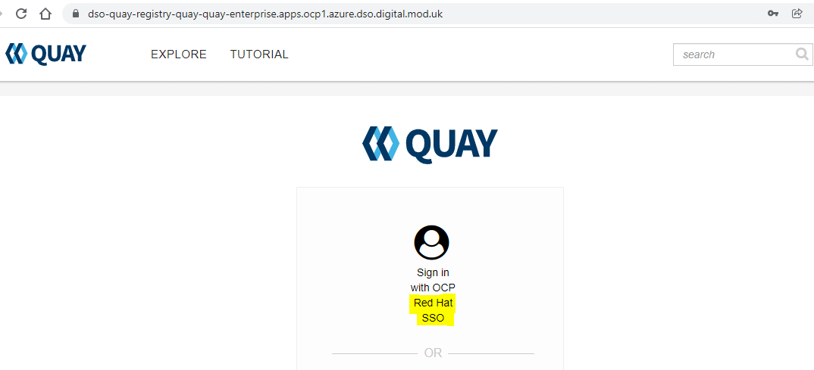

Add username and password provided to you by the platform admin on the screen below. You will be required to change your password if logging in for the first time.

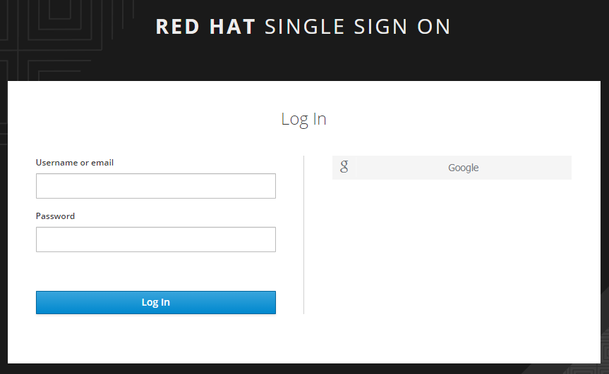

**2. Create Quay Organisation** by opening below [page](https://dso-quay-registry-quay-quay-enterprise.apps.ocp1.azure.dso.digital.mod.uk/organizations/new/). Add appropriate organisation name following naming convention relevant to your team. E.g mod-dev-team-a

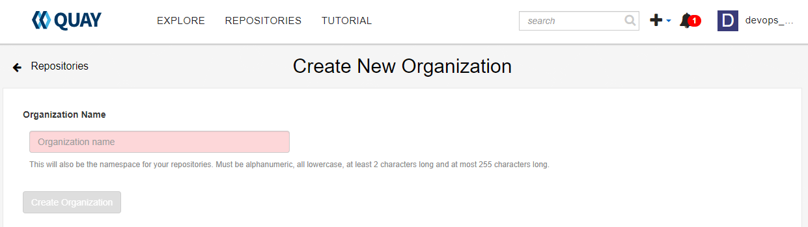

**3. Create Teams(groups)** for Team Leads and developers.

Once Organisation is created, click on the organisation from the home page

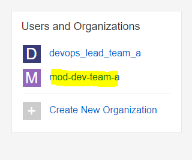

Click on the teams and membership tab and click on &quot;Create New Team&quot;

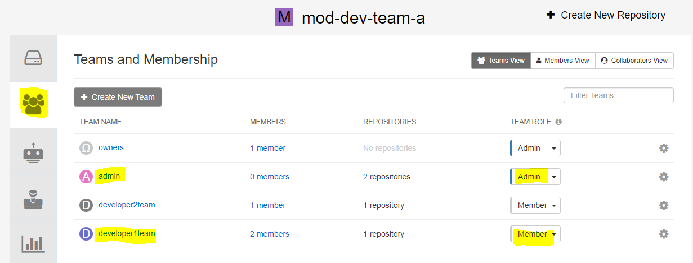

As shown above (1) an Admin Group with admin role is created. (2) a developer team with member role is created. (use appropriate naming convention for the group of your team)

**4. Create Robot Account** to be used by pipeline

Click on the robot accounts tab and click on the &quot;Create Robot account&quot;

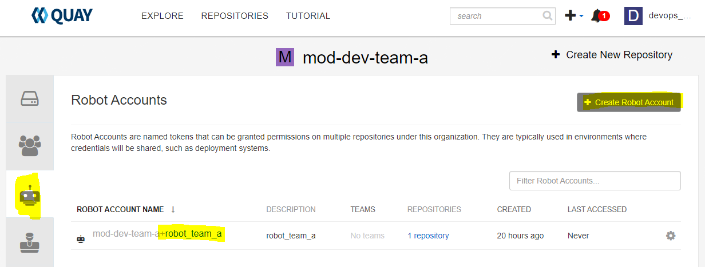

As can be seen above a robot\_team\_a account is created. (Use account name relevant to your project)

Clicking on the account name displays the credentials for the robot account to configure a secret to be used on the pipelines. There is also option to regenerate new token for the robot account.

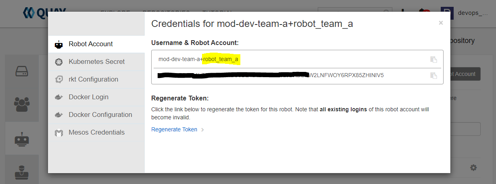

## Pull secret:

Create Kubernatives pull secret with secret .dockerconfigjson
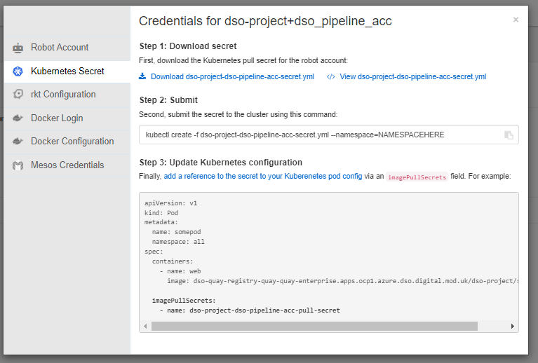

Create secret on ocp and add it to the pipleline and default service accounts.

Example screenshot
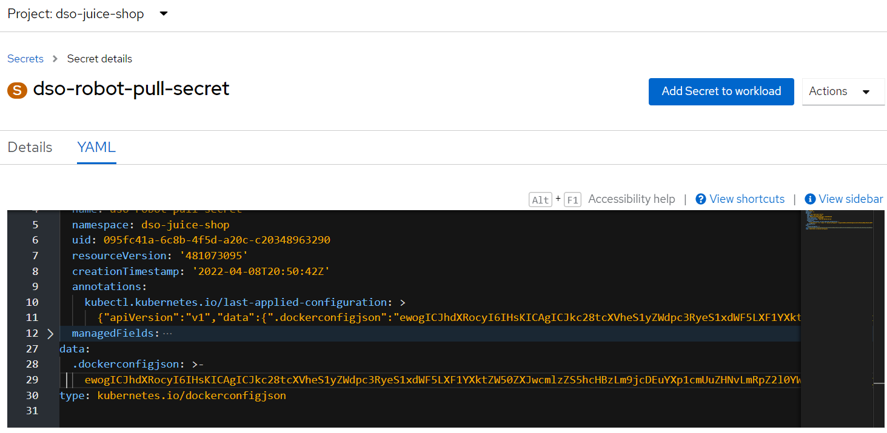

## Add Pull secret to Service account

Add secret to pipleline and default accounts under ImagePullSecret

Example screenshot
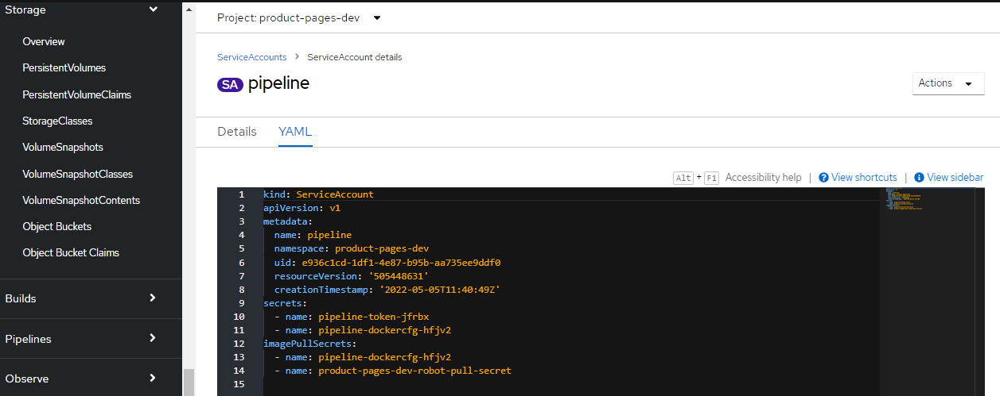

**5. Create Repository** to be used by application

NOTE: the repository name needs to be the same as the application name.

Click on the &quot;Create New Repository&quot; button on the home page as highlighted below

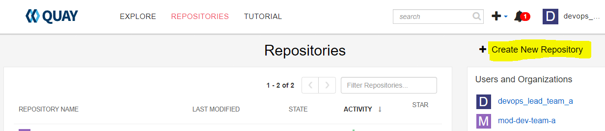

Below screen shows the details required on creating new repository. (1) ensure you select the correct organisation from the drop down. (2) Add a repository name. (3) Add repo description if required (4) select on repository visibility Public/Private

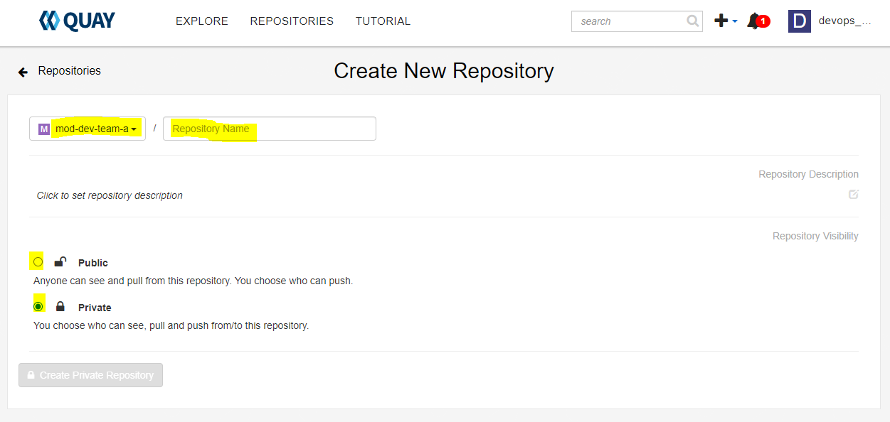

**6. Assign Developer Team(group)** (Read-Only) permission to repos. Assign robot account permission (Write) to repos

Once Repository is created, from Quay home page, click on the repository name to setup permission as shown below

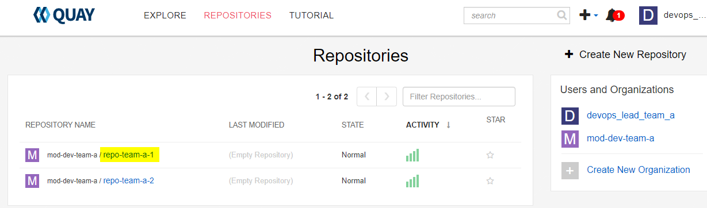

Go to the repository settings tab to add teams, update permissions.

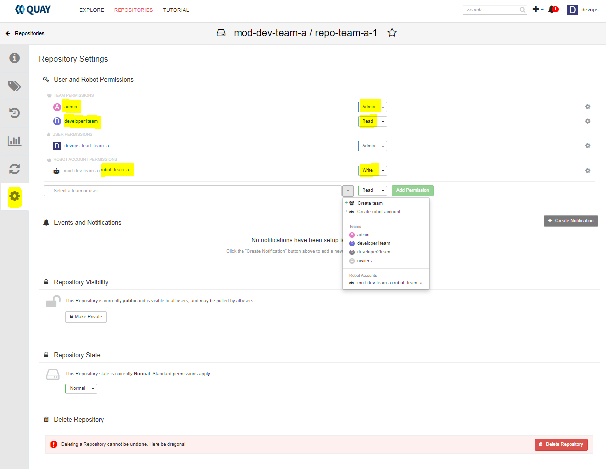

To add Teams, you can use the field below. The pre-created Teams (admin, developer) are listed here for ease of selection.

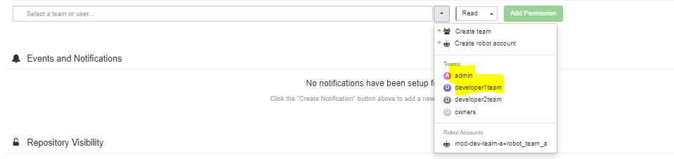

**7. Add or remove Team members** to the group

Go to the organisation home page by clicking the list from Quay home page as shown below.

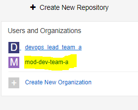

Go to the &quot;Teams and membership&quot; tab and select the appropriate team name as shown below.

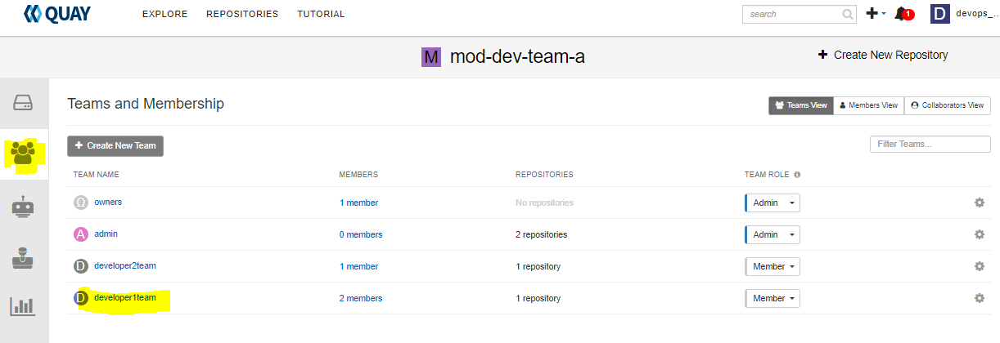

The below screen shows the Team settings to add users, robot account or remove as required. To add users use the Team member search field.

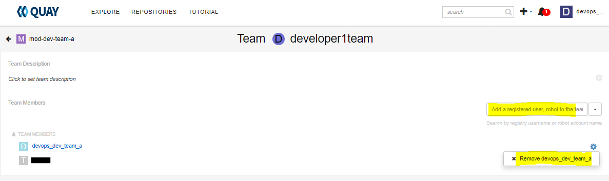

# Quay Onboarding – Developer

**1. Log in to Quay (through RH-SSO)** . OpenShift Quay can be accessed [here](https://dso-quay-registry-quay-quay-enterprise.apps.ocp1.azure.dso.digital.mod.uk/organizations/new/).

Click on the link below (highlighted) to connect using your RH SSO credentials.

Add username and password provided to you by the platform admin on the screen below. You will be required to change your password if logging in for the first time.

Once connected your organisation is visible as shown below:

Repository is listed below:

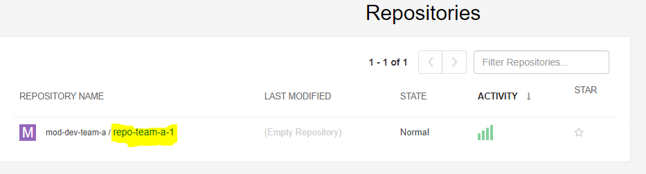

Clicking on the repository name, its possible to view repository activity, Application Tags (versions) that&#39;s are pushed to this repository and tag history.

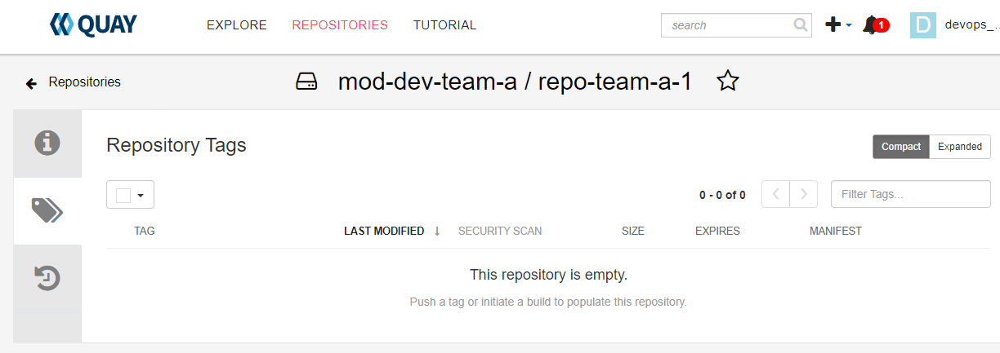
