# Introduction #
SonarQube is a Code Quality Assurance tool that collects and analyses source code and provides reports for the code quality of the projects. SonarQube also ensures code reliability, Application security, and reduces technical debt by making the codebase is clean and maintainable. 

This document lists the steps required to onboard projects to be able to manage and use SonarQube tool.

# Summary #

Admin user has the rights to create projects and assign ownership (eg: Team Leader) and on board the Users/Groups for the project. 

Team Leader of the projects can assign the permission to the users and groups for the team to perform different functionality. 

**Note: A public example project called juice-shop is available on the dashboard and the document lists all the appropriate screen shots. The two demo projects named area as follows, Project-A and Project-B which has two users, demo_lead and demo_developer.

# Onboarding #
 
 1. User logs in to SonarQube (through Google id).  

 2. SonarQube can be accessed [here](https://sonarqube-https-dso-tooling-sonar.apps.ocp1.azure.dso.digital.mod.uk/).
 
 3. Click on Log in with OpenID button. 

# Creating the projects 

Admin user or user who has admin privileges has rights to create the projects or groups. Please reach out SonarQube admin via support email (dso.support@digital.mod.uk ).

# login as demo_Lead:

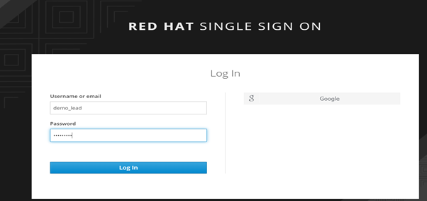

Dashboard for demo_lead 

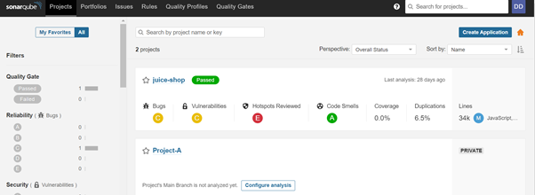

 Demo lead can see the public project and Project-A (owner of the project).
 
 
Apply permission to the Users/ Groups

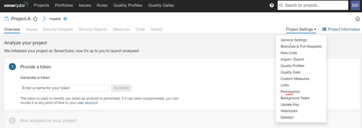

 This screenshot shows only Demo lead can perform the project settings.
 

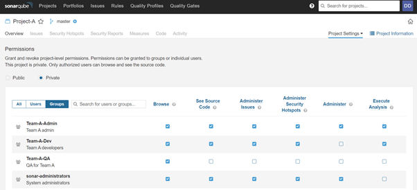

Groups are created for modularity and Demo lead can add user into different groups.

Example:

    Team-A-Admin for project administration
    
    Team-A-Dev for developers
    
    Team-A-QA for test users
    
    
    

Select required Quality Gate

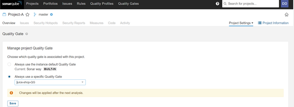

Select the Quality Gate.

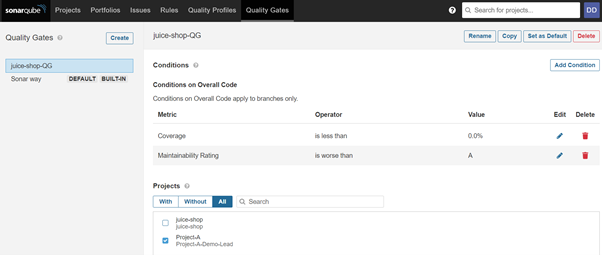

Project quality gate criteria defined by demo lead.

# Login as demo_developer #

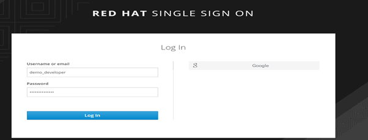

Developer Dashboard

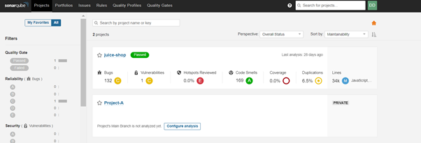

Developer cannot perform project settings

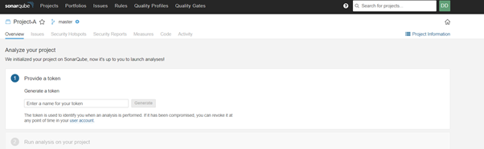

Select Project Information

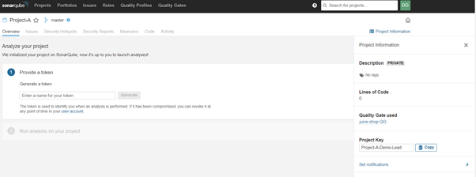

Developer cannot select quality gate

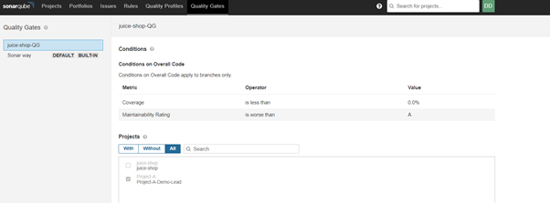

# Eg: Isolate from Project-A to Project-B #

Project-B owned by Team-B can only their project

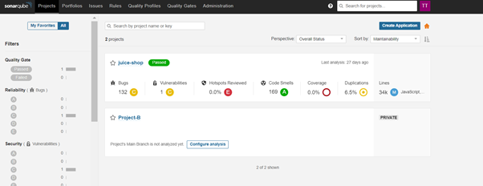

only user from Team-B can view the Project-B and public project

# Admin user #

Admin user can view all projects.

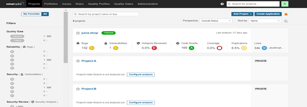

