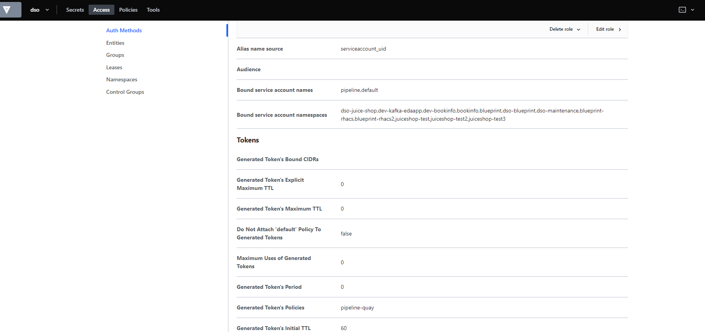
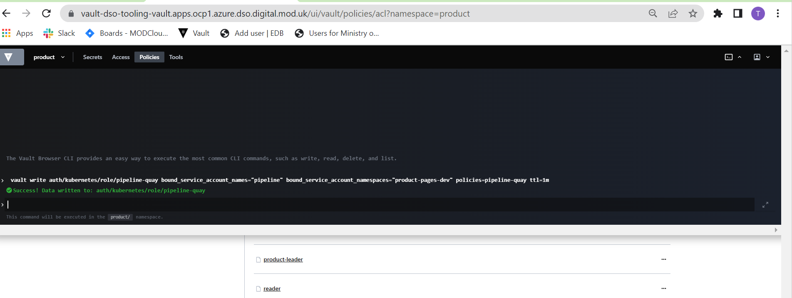

[HashiCorp Vault](https://www.vaultproject.io/docs/internals/architecture) is designed to help organizations manage access to secrets and transmit them safely within an organization. Secrets are defined as any form of sensitive credentials that need to be tightly controlled and monitored and can be used to unlock sensitive information. Secrets could be in the form of passwords, API keys, SSH keys, RSA tokens, or OTP.

### Prerequistes 
- A platform admin should configure your team with its own set of groups on RH-SSO
- A platform admin should provision a configured [Vault namespace](https://www.vaultproject.io/docs/enterprise/namespaces) for your team and provided the name of this namespace.
- Per each group on created on RH-SSO, the Team Lead should configure the permissions via [ACL Policies](https://vault-default.apps.ocp1.azure.dso.digital.mod.uk/ui/vault/policies/acl) for their use case ([following the steps below](#ACL-Policies))

**The below onboarding example is based on a team being provisioned the Vault namespace 'team1'.**

# High level tasks:

  1. Vault Onboarding - Team Lead to control on namespace(s)
  
    eg: engineering-admin
    
  3. Vault Onboarding - Developer to control access

    eg :reader

  3. Vault Configuration for pipeline to run as per tools 
    
    => Secrets (github,soanr and quay)
   
    => Access Role (Auth Methods)
    
       eg: pipeline-github,pipeline-sonar and pipeline-quay
   
    => Create ACL policy
    
       eg: pipeline-github,pipeline-sonar and pipeline-quay

  4. Example usage of a secrets
  


# Vault Onboarding - Team Lead (Admin)

1. Log in as Team Lead on the provisioned vault namespace ('team1' per the example)

Select OIDC From the Login Screen


Click 'Sign in with OIDC Provider'

**Note: Leave Role as default otherwise logging in will not work.**


it will open a popup showing the RH-SSO screen, where you can log in via Google SSO


By default once authenticated, no secret engines will exist aside 'cubbyhole', therefore create an inital secret engine for your team by clicking 'Enable new engine'


Choose your secret engine type as per your requirement. See the [documentation](https://www.vaultproject.io/docs/secrets) for more details on usage. Per this example we'll setup a simple kv engine to store our pipeline secrets


After clicking 'Next' you can name and create your secret engine 

Name and create your secret engine


After enabling the engine, you will see this error as your use does not have access to the created secret engine


Navigate to 'policies' from the top menu, and click on the “policies” section to update your own policy


Note: Sometimes Vault does not navigate to the namespaced policies URL, ensure in the URL it has **?namespace=\<namespace\>** otherwise navigate a page back in your browser and retry the navigation link.


<a name="ACL-Policies"></a> 	
Once on the policies page, you'll be able to view the ACL Policies for this namespace. You should expect to see the following ACL Policies: 
 
  - default - do not edit the namespace 
  - \<namespace\>-admin - this has the permissions for Team Lead users
  - \<namespace\>-users - this has the permissions for team members

Access \<namespace>-admin policy and extend the ACL Policy so that you have full permissions for the newly created secret engine.


Add in administrative permissions for yourself to manage secrets at the name of the secret engine (do similar with restricted permissions for team members as required)


For team members you may want to restrict so they only have the ability to list secrets (so that they know which paths to use in their API calls), but not view contents like so:

```
path "kv/*" {
   capabilities = ["list"]
}

path "cubbyhole/*" {
  capabilities = ["deny"]
}
```

Refer to the [documentation for more details on creating policies](https://www.vaultproject.io/docs/concepts/policies)

If you navigate back to ‘Secrets’ section you’ll be able to view your newly created secrets engine


You can now create your secrets as required


# Vault Onboarding - Developer

Select OIDC From the Login Screen on the provisioned vault namespace ('team1' per the example)


Click 'Sign in with OIDC Provider'
Note: Leave Role as default otherwise logging in will not work.


it will open a popup showing the RH-SSO screen, where you can log in via Google SSO


Once authenticated you will be able to view any secret engines as configured by your team lead.


________________________________

For additional information on integrating vault with your applications [see here for further details](https://learn.hashicorp.com/tutorials/vault/secure-introduction?in=vault/app-integration)

# Configuring Kubernetes Access to a single secret (admin) 
 Eg : Configuration for pipeline to access.

Typically pipelines require access to secure secrets like github credentials / quay robot accounts etc. We can store those inside a kv vault storage (as configured in the Team Lead onboarding section). For our pipelines to be able to leverage these secrets the [Kuberentes Auth Method](https://www.vaultproject.io/docs/auth/kubernetes) is enabled. 

Similarly applications may require access to secure secrets in similar ways such as [database credentials](https://www.vaultproject.io/docs/secrets/databases/postgresql), API tokens etc. 

We can configure a policy within vault that has access to only the required secret (e.g. github) for the purpose of being accessed from the pipeline and a role bound that will only allow a combination of a specific **namespace** + **service account** to be able to utilize the secret. This relies on the jwt supplied from the service account inside of pods.

Using the prior example of a 'pipeline' KVv2 secret engine I have created a dummy github secret:


## Configuring a policy (admin)

Navigate to 'policies' from the top menu, and click on the “policies” section to create a new ACL policy


Click Create ACL Policy from the right hand menu


We can now write a policy that only allows access to the **values** from the 'github' secret on the 'pipeline' secret engine. [Refer to the policy syntax for more details](https://www.vaultproject.io/docs/concepts/policies#templated-policies)

```
path "kv/data/github"{ 
  capabilities = ["read"]
}
```


NOTE: the secret name is prefix with /data to access the values of the 

## Configuring a role (admin)

We can create a role that kubernetes can use to access any information specified in the above policy either via the inbuilt terminal or the 'Access' UI section of Vault.

### Via UI 

Navigate to the 'Access' section of Vault


Click on the 'Kubernetes/' auth method 


Click 'Create Role'


Bind the Role to the required  **service account** + **secretname** combination as example.


Additioanlly configure a TTL as per your requirements (for the sake of pipelines these should be as short lived as possible)


### Via CLI 

Click on the terminal icon on the top right hand side of the UI.


run the following command (replace as required for your namespace / service accounts)
```bash
vault write auth/kubernetes/role/pipeline-github bound_service_account_names="pipeline" bound_service_account_namespaces="dev-team1" policies=pipeline-github ttl=1m
```


NOTE: passing a comma delimited list is a permissiable input

### Sonar Vault Configuration Via UI 

Create Secret under KV : sonar


Navigate to the 'Access' section of Vault
Click on the 'Kubernetes/' auth method : pipeline-sonar


Navigate to the Policies section of Vault
Create ACL policy:  pipeline-sonar


### Via CLI 

Click on the terminal icon on the top right hand side of the UI.


run the following command (replace as required for your namespace / service accounts)
```bash
vault write auth/kubernetes/role/pipeline-sonar bound_service_account_names="pipeline" bound_service_account_namespaces="dev-team1" policies=pipeline-sonar ttl=1m
```

### Quay Vault Configuration Via UI 

Create Secret under KV : quay


Navigate to the 'Access' section of Vault
Click on the 'Kubernetes/' auth method : pipeline-quay



Navigate to the Policies section of Vault
Create ACL policy:  pipeline-quay


### Via CLI 

Click on the terminal icon on the top right hand side of the UI.



run the following command (replace as required for your namespace / service accounts)
```bash
vault write auth/kubernetes/role/pipeline-quay bound_service_account_names="pipeline" bound_service_account_namespaces="dev-team1" policies=pipeline-quay ttl=1m
```


# Example usage of a secret via kubernetes auth 

3 ClusterTasks are preconfigured on the platform to work with Vault, they are: 

- vault-git-clone - task to clone from git, using username and personal access token from vault
- vault-build-image - task to build a container image, using credentials for a quay robot account to push to a quay organization
- vault-git-update-deployment - task to update an image digest in a Git repo using kustomize, using username and personal access token from vault
- vault-sonarqube-scanner - task to run sonar scanner, using username and personal access token from vault

All 3 of these ClusterTasks specifically expect the following inputs to be provided on a Pipeline as inputs to the task. They have some default values that must be overriden. 

Example inputs in PipelineRun file
```yaml 
  - name: VAULT_NAMESPACE
    value: dso  
```

This can be referened in a Pipeline (example from kafka pipeline) like so:
Reminder: This will only work from the pipeline if the service account + namespace used matches what is configured on the kubernetes authentication role. 

```yaml
  - name: fetch-repo
    params:
      - name: url
        value: $(params.GIT_URL)
      - name: revision
        value: $(params.REVISION)
      - name: subdirectory
        value: $(params.REPO_NAME)
      - name: useVault
        value: 'true'
      - name: vaultRole
        value: pipeline-github # Does not need to be provided as it matches default value, although here for illustrative purposes.
      - name: vaultNamespace
        value: $(params.VAULT_NAMESPACE) # per our example our secrets are stored in the 'team1' namespace 
      - name: vaultPath
        value: kv/data/github # per our example our secrets are stored in 'pipeline'
        
    taskRef:
      kind: ClusterTask
      name: vault-git-clone
    workspaces:
      - name: output
        workspace: shared-data

  - name: vault-sonarqube-scanner
    params:
    - name: SONAR_HOST_URL
      value: "$(params.SONAR_HOST_URL)"
    - name: SONAR_PROJECT_KEY
      value: "$(params.SONAR_PROJECT_KEY)"
    - name: REPO_NAME
      value: "$(params.REPO_NAME)"
    - name: useVault
      value: 'true'
    - name: vaultRole
      value: pipeline-sonar
    - name: vaultNamespace
      value: $(params.VAULT_NAMESPACE)
    - name: vaultPath
      value: kv/data/sonar
    taskRef:
      kind: ClusterTask
      name: vault-sonarqube-scanner
    workspaces:
    - name: source-dir
      workspace: shared-data
    - name: sonar-settings
      workspace: shared-data
    runAfter:
    - fetch-repo
          
```
