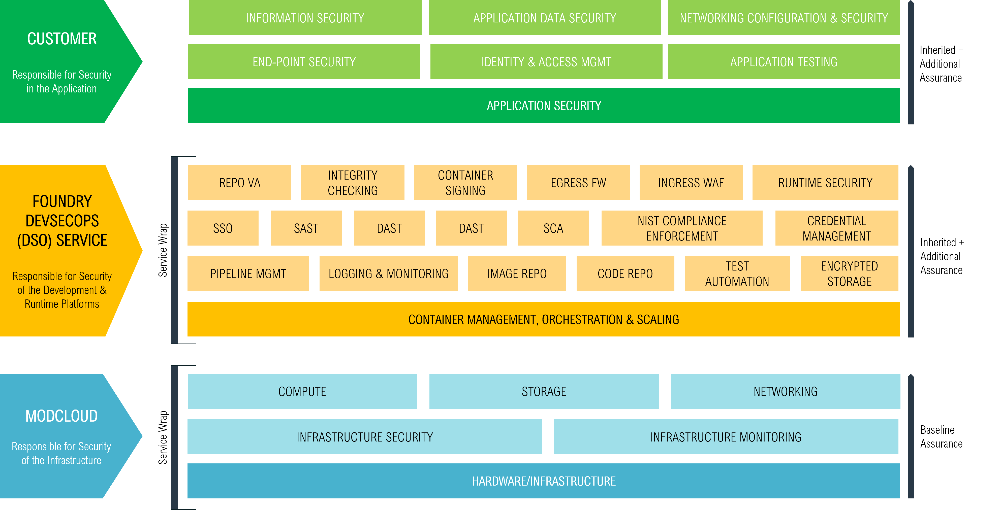
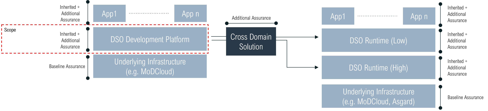
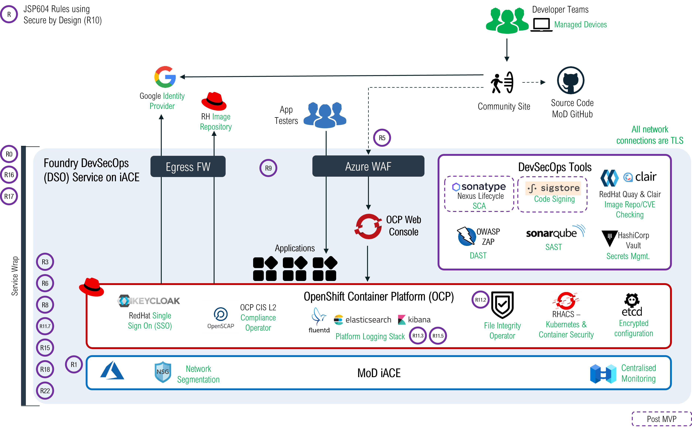

# Approach to Application Assurance when using Foundry DevSecOps (DSO) Service
`version 0.2`

## Introduction
This document outlines what assurance DevOps teams can inherit from the Foundry DSO platform, either via the OpenShift Container Platform (OCP), provided core functionality, the pipeline or the security tooling present.

The Foundry DSO service has been assured using Secure by Design (SbD) and can provide services at OFFICIAL and SECRET.

The Foundry DSO service operates on the notion of Inherited Assurance, where applications built on the DSO service can use an approved Software Development LifeCycle (SDLC) and inherit the default security controls that are available on the platform. This will allow the application assurance/accreditation process to be constrained to the specifics of the application, with the DSO assured elements known to be secure by design.

The diagram below provides a view of the shared responsibility model for assurance which applies when using the service. As an Application Owner, it is recommended that you start the Assurance/Accreditation process as soon as possible, to ensure there are no delays to launching your applications in production. While using the Foundry DSO development service, accreditation/assurance is not required, provided the Foundry SyOps has been signed and accepted. However moving code/containers to the Foundry DSO production service requires IATO to be completed. It is the responsibility of Application Owners to ensure that this is in place.

The DSO service provides a large amount of inherent applications and services that can support application level assurance.

Your JSP604 accreditation scope can therefore concentrate on the application, its data, its governance and its specific security controls, without worrying about the dev/build environment or underlying infrastructure. The diagram below shows the security tooling and JSP rules as they apply to the platform. Using just these assured tools in your pipelines will reduce your assurance efforts.

## Functional List of Security Provided

- Assured development, build and testing environment provided by OCP, which provides Kubernetes (K8s) and container runtime environments

- Logging & Monitoring:

	- **Fluentd** - Log data collector
	- **Elasticsearch** - Data storage and log examination/search
	- **Kibana** - Visualisation of log information
	- **Prometheus** - Provides service monitoring, including multidimensional data model, a powerful query language called PromQL and an efficient embedded time series database
	- **Grafana** - Provides visualization and analytics from monitoring data helping  to track the user behaviour, application behaviour, frequency of errors present in production or pre-prod environment etc.

- Platform Support:

	- **Quay** - Image Repository
	- **Tekton** – Used for build and test pipeline orchestration
	- **Nexus Repository Pro** _[Under Review]_ - Artefact Repository
	- **File Integrity Operator** - Equivalent to anti-malware and ensures that files remain integral and free from malware

- DevOps Tooling:

	- **ArgoCD** – Continuous delivery tool used for automating deployments on the platform
	- **Cucumber** _[outside of assurance scope]_ – Behaviour driven development tool that provides support for building test cases to test the behaviour/ functionality of the software. 
	- **Helm** _[outside of assurance scope]_ – Used for container-based applications packaging configuration and deployment
	- **Maven** _[outside of assurance scope]_ - build and management tool for Java applications
	- **Kustomize** _[outside of assurance scope]_ - Traverses a Kubernetes manifest to add, remove or update configuration options without forking

- Platform Security:

	- **RedHat Advanced Cluster Security (RHACS)**
		- K8s API Interaction & User Access Monitor & Reporting
		- Container runtime & network activity monitoring
		- Scans all image layers for CVE vulnerabilities
		- K8s & container security policy definition and enforcement
		- Compliance checking and monitoring across cluster
		- Visualise network policies

	- **RedHat Compliance-Operator** - Provides cluster wide implementation of compliance as code, based on OpenSCAP
	- **RedHat SSO (KeyCloak)** - Federated identity services and single sign on across the platform
	- **RedHat Claire** - is a Container Security Operator that provides security enforcement for images on Quay by carrying out static analysis of vulnerabilities, using CVEs, in appc and docker containers

- Pipeline Security Tooling:
	
	- **Nexus Lifecycle** _[Under Review]_ - Software Composition Analysis (SCA) tool for supply chain checks
	- **Sigstore** – Signing tool used for container image signing. It is used to verify the origin and authenticity of the container images.
	- **SonarQube** – Static Analysis (SAST): Provides continuous inspection of code quality to detect bugs and security vulnerabilities.
	- **OWASP ZAP** – Dynamic Analysis (DAST): Open Web Application Security Project is a tool that allows security testing by detecting common threats to web applications.
	- **Hashicorp Vault** - Securely manages credentials and secrets for App Developers

- SaaS Services:
	- **Github** - software code repository for dev teams
	- **Google IDP** - provides authentication services for development teams

- Additional support packages:
	- **Kafka** - Event streaming platform
	- **Istio** - Service mesh service
	- **Postgres DB** - RDBMS database
	- **Mongo DB** - NoSQL database

## What this means for you

These capabilities have undergone Secure by Design (SbD) and JSP604 assurance and hence can be used within your applications, to remove the burden of accreditation by inheritance of security. 
